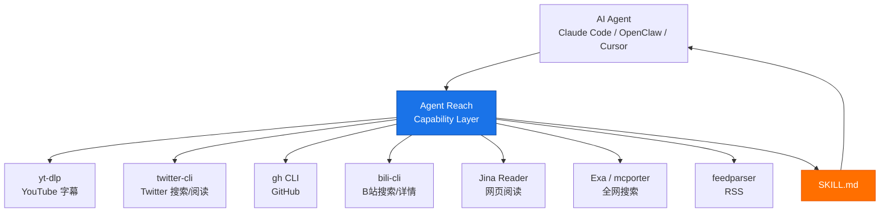

# Agent-Reach 深度解析：给 AI Agent 装上互联网能力的架构哲学

## 项目概览

**Agent-Reach** 是本周 GitHub Trending 上最炙手可热的项目之一——38,000+ stars，一周内暴涨 8,000+ stars。它以一句简洁的口号吸引了无数 AI 开发者：

> "Give your AI agent eyes to see the entire internet."

项目的核心理念极其直白：AI Agent（Claude Code、OpenClaw、Cursor 等）能写代码、改文档、管项目，但一旦需要去网上获取信息就处处碰壁——Twitter API 要付费、Reddit 匿名接口被封、B站被风控拦截、小红书必须登录。Agent-Reach 用一条命令解决所有这些痛点，让 Agent 通过 CLI 工具链零成本（无 API 费用）读 Twitter、搜 Reddit、看 YouTube 字幕、刷小红书、查 GitHub。

但真正让这个项目值得深度解析的，并非它的功能列表，而是其背后独特的**架构设计哲学**。

## Capability Layer：一个被绝大多数项目误解的概念

Agent-Reach 最值得借鉴的设计决策，是它明确界定了自己**不是什么**。

README 中有一句话堪称整篇文档的灵魂：

> "Agent Reach 是一个能力层（capability layer），不是又一个工具。"

这不是营销话术，而是一个极其重要的架构约束。大多数"给 Agent 加能力"的项目会走向两个极端：

1. **封装层方案**——自己写一套 Python/JS SDK，把所有平台的 API 统一包装，Agent 通过 SDK 调用。问题是：上游 API 一变，SDK 就断；平台一加反爬，整个封装层需要重写。

2. **纯文档方案**——告诉用户"你可以用 yt-dlp、用 gh CLI、用 twitter-cli"，但不负责安装、配置、体检、路由。用户仍然需要自己折腾。

Agent-Reach 走了第三条路：**它只做选型、安装、体检、路由，不做读取本身**。读取由 Agent 直接调用上游工具完成，没有包装层。



这个设计在工程上带来了三个直接收益：

**第一，零维护成本的上游兼容。** yt-dlp 有 154K stars，社区维护极其活跃；gh CLI 是 GitHub 官方工具。Agent-Reach 不需要为每个平台维护一套 SDK，上游工具自然会演进。当某个工具停更（如 xhs-cli 在 2026 年 3 月停更），只需在路由列表中切换后端，不需要改代码。

**第二，Agent 能力的自然扩展。** 由于 Agent 直接调用上游 CLI，任何上游工具的新功能自动变成 Agent 的能力。yt-dlp 更新支持了新格式？Agent 立刻就能用。

**第三，安全面更可控。** Cookie 和 Token 只存在本地 `~/.agent-reach/config.yaml`，文件权限 600，所有上游工具也是开源项目。Agent-Reach 本身没有中间人风险。

## 多后端路由：反脆弱的核心机制

Agent-Reach 最具工程智慧的组件是其**多后端路由**（multi-backend routing）设计。

每个平台不是绑定单个工具，而是维护一个有序的候选后端列表。以 channels 目录下的模块为例：

```python
# 伪代码示意
class BilibiliChannel:
    backends = ["bili-cli", "OpenCLI", "search API"]
    
    def check(self, config):
        # 按序探测，第一个完整可用的当选
        for backend in self.backends:
            if is_available(backend):
                self.active_backend = backend
                return ("ok", "可用", backend)
        return ("off", "当前无可用后端")
```

这个模式解决了一个被大多数项目忽视的问题：**依赖的外部工具总会失效**。

2026 年 6 月的真实案例：yt-dlp 被 B站风控系统 412 拦截封死。如果 Agent-Reach 是硬编码 yt-dlp 作为唯一后端的封装层，此时整个 B站功能就挂了。但 Agent-Reach 的 channels 层自动切换到了 bili-cli（无需登录即可搜索和读取视频详情），用户零感知。

`agent-reach doctor` 命令就是这一设计的展示窗口——它会告诉你每个平台当前走的是哪个后端，以及如果当前后端失效，备选方案是什么。这不是事后补救，而是内置的设计特性。

## Tier 分级：渐进式配置体验

Agent-Reach 将所有平台划分为三个 tier，对应不同的配置成本：

| Tier | 说明 | 示例 | 配置成本 |
|------|------|------|----------|
| 0 | 装好即用 | 网页、YouTube、RSS、GitHub、B站搜索 | 零 |
| 1 | 简单配置 | 全网搜索（Exa MCP）、雪球 | 免费 Key |
| 2 | 需要登录 | Twitter、小红书、Reddit、LinkedIn | Cookie / 浏览器登录态 |

这种分级的工程意义在于：**用户第一次安装时，80% 的常用功能已经可用**。不需要一上来就处理 Cookie 导出、扫码登录等摩擦操作。

更好的设计是，安装流程不是一次性配置完所有平台，而是先激活 6 个零配置渠道（网页、YouTube、RSS、GitHub、B站搜索、全网搜索），然后用菜单询问用户哪些登录平台需要配置。这种渐进式激活减少了首次安装的认知负担。

## 与竞品的对比分析

市场上有几个与 Agent-Reach 存在交集的方案：

**BrowserAct** — 定位是浏览器自动化工具，支持 30+ 预制平台技能。与 Agent-Reach 的核心差异是：BrowserAct 是"动手"层（登录、表单、会话管理），Agent-Reach 是"读"层（信息获取）。README 中明确建议两者配合使用，而非替代关系。

**Firecrawl**（137K stars）— 专注网页抓取和 API 化。更强但在社交媒体（Twitter、Reddit、小红书）支持上不如 Agent-Reach 广泛。Firecrawl 是 SaaS 产品，Agent-Reach 是完全本地运行的开源方案。

**Tavily** — AI 优化的搜索引擎，提供 MCP 接入。Agent-Reach 内置 Exa 作为搜索引擎后端，Tavily 可视为同类替代。但 Agent-Reach 的价值远不止搜索。

**各种单平台 CLI** — twitter-cli、bili-cli、rdt-cli 等。这些是 Agent-Reach 的上游依赖，而非竞品。Agent-Reach 的价值在于集成：把零散的 CLI 统一到一个安装+体检+路由框架中，让 Agent 通过一份 SKILL.md 就学会使用所有工具。

## 潜在问题与改进空间

任何一个认真做架构分析的文章，都应该指出项目中可能存在的问题。

**1. 依赖链过长。** 安装 Agent-Reach 意味着你的 Agent 依赖了 10+ 个外部工具，每个都可能引入版本兼容问题。虽然多后端路由缓解了单点故障，但依赖树的总体复杂度仍然较高。一个 `agent-reach doctor` 跑下来可能报出一堆绿色，但实际使用中某个上游 CLI 的某个参数变了，Agent 调用的命令仍然可能失败。

**2. Cookie 安全性虽然是本地存储，但流程上有摩擦。** 需要 Cookie 的平台（Twitter、小红书）需要用户手动从 Chrome 用 Cookie-Editor 插件导出、再发给 Agent。这个流程对非技术用户来说不够友好，也存在一定的人为泄露风险。虽然建议使用小号，但 README 中的风险提示可以更醒目地放在配置说明之前，而非文档中部。

**3. Agent 兼容性深度不均。** 虽然宣称兼容所有 Agent，但 OpenClaw 用户需要手动开启 exec 权限（`openclaw config set tools.profile "coding"`），这对默认配置的用户来说是一个额外的理解门槛。这个问题本质上是 Agent 平台的安全策略差异导致的，但 Agent-Reach 可以在安装时自动检测并给出更针对性的配置建议。

**4. Vibe coding 的质量不确定性。** 项目自述是 "pure vibe coding"，代码质量可能不如经过严格审查的企业级项目。对于生产环境使用的用户，建议 fork 代码后自行审查 channels 目录下的核心逻辑。

## 适用场景与技术判断

Agent-Reach 最适合的场景是：

- **个人 AI Agent 开发工作站** — Claude Code / Cursor / OpenClaw 用户的日常信息获取需求
- **跨平台信息聚合** — 需要从多个社交媒体和内容平台获取数据的场景
- **快速原型** — 不想为每个平台申请 API Key、调通 SDK 的初期阶段

不适合的场景包括：

- **大规模生产爬虫** — Cookie 认证不适合高频调用，封号风险太大
- **合规敏感的业务场景** — 使用 Cookie 绕过平台限制在某些场景下可能存在合规问题
- **零 CLI 环境** — 如纯浏览器端的 Agent 运行环境

## 总结

Agent-Reach 是一个设计思路非常清晰的开源项目。它的成功不是因为它实现了什么复杂算法，而是因为它做了一个极其重要的**架构取舍**：不重复造轮子，而是为现有优秀工具提供一个智能的路由和体检层。这个 "capability layer" 模式，对于 AI Agent 工具生态的演进方向具有启发意义。

作为一个 2026 年趋势性项目，Agent-Reach 也折射出 AI Agent 发展到一个新阶段的需求：Agent 不再是实验室里的对话玩具，而是需要真正接入互联网各个角落的生产力工具。让 Agent "看到"整个互联网，这件事本身正在成为基础设施。

> 项目地址：https://github.com/Panniantong/Agent-Reach
> Stars：38,013 | License：MIT | 语言：Python
