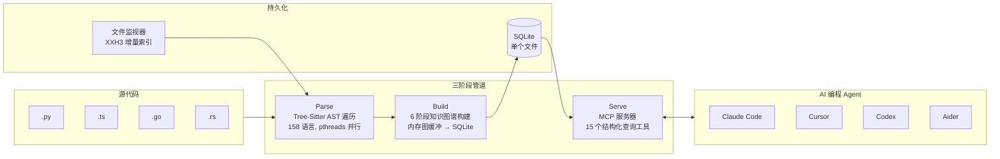

## 1. 项目速览（TL;DR）

**一句话定义：** 一个单静态二进制、零依赖的 MCP 服务器，用 Tree-sitter 将任意代码库解析为持久化知识图谱，让 AI 编程 Agent 用图查询替代文件 grep。

**当前状态：**

| 指标 | 数据 |
|------|------|
| Stars | 33,558（本月 +24,600） |
| Forks | 2,557 |
| 许可证 | Apache 2.0 |
| 主要语言 | C（单二进制，编译了 158 种 Tree-sitter grammar） |
| 最近发布 | 持续活跃，GitHub Actions CI 通过 |
| 学术支撑 | arXiv:2603.27277（10 页，5 位作者，来自 Charité 柏林医学院 + 柏林自由大学 + 洪堡大学） |

> **信息来源：** GitHub 仓库 README、arXiv:2603.27277 论文

**Verdict：值得投入。** 如果你在用 Claude Code / Cursor / Codex 等 AI 编程工具处理中型以上代码库，这个项目能显著降低 token 消耗并提升代码理解的准确度。它是目前同类产品中工程完成度最高、部署最简单的方案。

## 2. 为什么存在？（Why）

### 它要解决什么具体问题？

AI 编程 Agent（Claude Code、Cursor、Aider 等）探索代码库的方式极其低效：

```
用户问："ProcessOrder 被谁调用了？"
  → Agent grep "ProcessOrder" → 返回 300 个匹配文件
  → 逐个 read 文件 → 每次读几百行
  → 再 grep 调用方 → 又 200 个文件
  → 再逐个 read...
```

论文给出量化数据：**5 次结构查询，传统文件探索消耗 ~412,000 tokens，通过 Codebase-Memory 只需 ~3,400 tokens**——降低 99.2%。工具调用也从几十次减少到个位数。

### 现有方案的痛点

| 方案 | 痛点 |
|------|------|
| grep + read（Claude Code 默认） | 每次查询都要从头探索，O(n) 复杂度，token 消耗随代码库线性增长 |
| Sourcegraph | 需要部署服务端，企业付费，不开源 |
| CodeQL | 需要专门数据库和 DSL，不是为 LLM 设计的 |
| GitHub Copilot 索引 | 云端不可控，语言支持有限 |
| RepoGraph / CodexGraph 等学术方案 | 需要复杂基础设施（图数据库、API Key），部署门槛高 |

> **信息来源：** arXiv 论文 Section 1-2，项目 README

### 核心洞察

论文提炼的洞察非常精准：

> **"LLM Agent 操作的是非结构化文本，但开发者问的问题是本质结构化的——调用图、依赖链、模块边界、影响分析。"**

这里的范式转换是：不去优化 Agent 的探索策略（SWE-Agent、AutoCodeRover 等已有工作都在做这个），而是**优化检索层本身**。把 O(n) 的文件遍历变成 O(1) 的图查询。

## 3. 架构与设计（How）

### 整体架构



> **信息来源：** 论文 Figure 1、Section 3.1

### 核心模块 1：六阶段图构建管道

论文 Section 3.3 详细描述了构建过程。整个管道在**单个 SQLite 事务**中执行，分为 6 个阶段：

| 阶段 | 输入 | 输出 | 关键技术 |
|------|------|------|----------|
| Phase 1 | 源文件 | 定义节点（函数/类/接口/枚举） | Tree-Sitter AST 遍历，提取签名、返回类型、修饰器 |
| Phase 2 | 源文件 + 定义 | 调用边 + 导入关系 | 8 种语言特定导入解析器 + 通用回退 |
| Phase 3 | 调用边 | 跨文件调用关系 | 6 策略级联调用解析（见下文） |
| Phase 4 | 类/接口 | 继承 + 实现边 | 类型层级解析 |
| Phase 5 | 全图 | 社区发现 | Louvain 算法，发现功能模块聚类 |
| Phase 6 | 全图 | HTTP 路由、死代码 | REST 端点匹配（6 种框架）、度过滤 |

阶段 1-4 写入内存图缓冲（`cbm_gbuf_t`，C struct 实现，基于哈希映射），完全绕过 SQLite。每个阶段用 pthreads 工作池并行分发，支持原子工作窃取（work-stealing）。构建完成后一次性 flush 到 SQLite，并延迟创建索引。

```c
// 核心数据结构（基于论文和 README 推测）
typedef struct {
    khash_t(name_map)  *nodes_by_name;   // 按限定名索引
    khash_t(id_map)    *nodes_by_id;     // 按临时 ID 索引
    khash_t(label_map) *nodes_by_label;  // 按类型标签索引
    cbm_edge_vec_t     *edges;           // 边向量
    size_t              node_count;
    size_t              edge_count;
} cbm_gbuf_t;
```

> **信息来源：** 论文 Table 3、Section 3.3

### 核心模块 2：6 策略级联调用解析

这是整个系统最精巧的部分。论文 Section 3.4 详细描述了一个**优先级递减的 6 策略级联解析器**，用于将原始的被调用方名称（如 `pkg.Func`）解析为知识图谱中的限定节点：

```
策略 1: Import Map 精确匹配（置信度 0.95）
  → 将 callee 拆分为 prefix.suffix
  → 在文件的 import map 中查找 prefix
  → 拼接模块限定名 + suffix
  → 在 FunctionRegistry 中精确查找

策略 2: Import Map 后缀匹配（置信度 0.85）
  → 策略 1 的精确匹配失败后的回退
  → 在 import 解析后的模块路径中尝试后缀匹配

策略 3: 同模块查找（置信度 0.90）
  → 用当前文件的模块名前缀 callee
  → 精确匹配

策略 4: 唯一名称匹配（置信度 0.75）
  → 在反向索引中按简单名称查找
  → 仅当全项目只有一个候选时接受
  → 如果不在 import 可达范围内则降权

策略 5: 后缀匹配（置信度 0.55）
  → 多候选时按 import 距离打分
  → 最近模块路径获胜

策略 6: 模糊匹配（置信度 0.30-0.40）
  → 字符串相似度的最后手段
```

**值得学习的设计：** 每个策略关联置信度分数，这不仅仅是工程上的"试一遍"，而是为后续的查询排提供了量化依据。Agent 在展示调用关系时可以标注低置信度的边（如 "可能调用了"），而不是假装 100% 准确。

> **信息来源：** 论文 Section 3.4

### 性能设计要点

1. **RAM-first pipeline：** 索引全程在内存中运行（LZ4 HC 压缩读取 → 内存 SQLite → 单次 dump），索引完成后释放内存回 OS
2. **增量索引：** 文件监视器用 XXH3 内容哈希检测变更，只重新解析修改过的文件
3. **融合 Aho-Corasick：** 模式匹配在 C 层面融合，避免多次遍历 AST
4. **单二进制：** 158 种 Tree-Sitter grammar 全部 vendored 编译进二进制，无运行时依赖
5. **SQLite 持久化：** 所有状态存在 `~/.cache/codebase-memory-mcp/` 下的单个 SQLite 文件中

## 4. 快速上手

### 安装

```bash
# macOS / Linux 一键安装
curl -fsSL https://raw.githubusercontent.com/DeusData/codebase-memory-mcp/main/install.sh | bash

# 带 3D 图可视化 UI
curl -fsSL https://raw.githubusercontent.com/DeusData/codebase-memory-mcp/main/install.sh | bash -s -- --ui

# Windows PowerShell
irm https://raw.githubusercontent.com/DeusData/codebase-memory-mcp/main/scripts/setup-windows.ps1 | iex
```

> **信息来源：** 项目 README Quick Start

安装脚本会自动检测已安装的编程 Agent（43 种客户端表面），配置 MCP 条目、技能文件和生命周期钩子。

### 核心使用示例

安装后重启 Agent，然后：

```bash
# 在你的项目目录里启动 Agent（以 Claude Code 为例）
claude

# 在 Agent 对话中：
"Index this project"
# → codebase-memory-mcp 解析整个代码库，构建知识图谱
# → Linux 内核（28M LOC, 75K 文件）：3 分钟
# → Django：6 秒
# → 普通中小项目：毫秒到秒级

# 结构化查询示例
"ProcessOrder 被哪些函数调用了？"
# → Agent 调用 trace_path(function_name="ProcessOrder", direction="inbound")
# → 返回完整调用链，<1ms

"如果我修改 UserService，哪些地方会受影响？"
# → Agent 调用 impact_analysis("UserService")
# → 返回影响范围 + 风险分级

"项目里有哪些从来没被调用过的函数？"
# → Agent 调用 dead_code_detection()
# → 返回零调用方函数列表（排除入口点）

"用一句描述这个项目的架构"
# → Agent 调用 get_architecture()
# → 返回语言分布、模块边界、热点、路由表
```

### 常见配置

```bash
# 开启自动索引（新项目首次连接时自动索引）
codebase-memory-mcp config set auto_index true

# 设置自动索引文件数上限
codebase-memory-mcp config set auto_index_limit 50000

# 关闭自动监视器注册（跨项目工作时避免混乱）
codebase-memory-mcp config set auto_watch false

# 启用 3D 图可视化（可选 UI 版本）
codebase-memory-mcp --ui=true --port=9749
# 浏览器打开 http://localhost:9749
```

> **信息来源：** 项目 README Configuration 部分

## 5. 横向对比

| 维度 | Codebase-Memory-MCP | Sourcegraph | CodeQL | RepoGraph（学术） |
|------|---------------------|-------------|--------|-------------------|
| 定位 | AI Agent 的代码检索层 | 企业代码搜索平台 | 变体分析/安全查询 | 代码图增强 Agent |
| 部署方式 | 单二进制，零依赖 | 需要服务端 + 数据库 | 需要专门数据库 | Python + Neo4j/NetworkX |
| 学习曲线 | ⭐ 极低（Agent 自动调用） | ⭐⭐ 中等 | ⭐⭐⭐ 陡峭（QL 语言） | ⭐⭐ 中等 |
| 语言支持 | 158 种（vendored grammar） | ~40 种 | ~10 种深度支持 | 取决于 Tree-sitter 配置 |
| Token 效率 | ~3.4K/查询 | 不适用 | 不适用 | 取决于接口设计 |
| 查询延迟 | <1ms（图查询） | 秒级 | 秒级 | 取决于后端 |
| 增量索引 | ✅ XXH3 自动检测 | ❌ 需手动触发 | ❌ 需重建数据库 | ❌ |
| 生态/插件 | MCP 标准接口 | 自有 API | VS Code 插件 | 无 |
| 维护活跃度 | ⭐⭐⭐⭐⭐ 极高 | ⭐⭐⭐⭐ | ⭐⭐⭐ | ⭐⭐ |
| 定价 | 免费开源 | 企业付费 | 免费 | 免费 |
| 团队协作 | 压缩导出 graph.db.zst | 服务端共享 | 数据库共享 | 无 |

> **信息来源：** 各项目官网及 GitHub 仓库

**关键差异：** Codebase-Memory 是目前唯一一个将"代码知识图谱"与"MCP 标准协议"结合、且做到单二进制零依赖部署的工具。它不是 Sourcegraph 的替代品（没有 Web UI 搜索），也不是 CodeQL 的替代品（没有复杂的数据流分析），而是专门为 AI Agent 设计的轻量级代码结构检索层。

## 6. 使用建议与风险评估

### ✅ 推荐使用场景

- **中型到大型代码库（1K-100K 文件）的 AI 辅助开发：** 这是 Codebase-Memory 的甜区。小项目（几百个文件）用 grep 也够快，超大项目（百万文件级）索引时间可能较长
- **微服务架构的跨服务调用链分析：** HTTP route → call-site 匹配 + CROSS_* 边，直观展示服务间依赖
- **接手遗留代码时的快速理解：** `get_architecture` + `trace_path` 组合，几分钟摸清项目骨架
- **CI/CD 中的增量影响分析：** `detect_changes` 工具可以集成到 PR 流程中，自动标注改动的影响范围
- **需要频繁做代码评审的团队：** 每次理解一个新 PR 的影响域，图查询比手动翻文件快得多

### ❌ 不推荐场景

- **小脚本/单文件项目：** 杀鸡用牛刀，grep 更快
- **需要深度数据流分析的场景：** 比如安全漏洞的污点追踪——这是 CodeQL 的领域
- **需要语义理解的场景：** 知识图谱回答"这段代码在做什么"的能力不如直接读代码（论文数据：83% vs 92%）
- **公开代码库的临时查阅：** 如果只是偶尔看一眼开源项目的某个函数，直接 GitHub 搜索更快

### ⚠️ 已知问题与风险

1. **语义理解有 9% 的质量差距：** 论文在 31 个仓库上的评估显示，对于需要理解"代码在做什么"的问题，图方式（83%）略低于直接文件探索（92%），虽然 token 消耗少 10 倍
2. **动态特性的盲区：** 纯静态分析无法捕捉反射调用、动态导入、eval、猴子补丁等运行时行为
3. **Windows 平台不够成熟：** SmartScreen 可能会报警告（因为二进制未签名）
4. **Hybrid LSP 覆盖有限：** 目前仅 12 种语言有深度类型推导，其他语言回退到纯 Tree-sitter 解析
5. **Cookie/隐私相关：** 如果你关心，项目明确声明"零遥测、全本地、不上传任何数据"

> **信息来源：** 论文 Section 4-5、项目 README Security、GitHub Issues

### 🔮 未来展望

- 论文提到计划扩展到更多语言的 Hybrid LSP 支持
- 社区讨论提及希望支持更多的 MCP 客户端（目前已支持 43 种）
- 可能的方向：将知识图谱嵌入作为 LLM 微调数据，直接提高模型对代码结构的理解能力

## 7. 总结

### 三个核心 Takeaway

1. **范式转换：从文本搜索到图查询。** AI Agent 不应该像人类一样逐文件 grep + read——代码库的结构信息可以被"编译"成知识图谱，让每次查询从 O(n) 降到 O(1)。这解决的是 AI 编程 Agent 当前最大的效率瓶颈：上下文窗口浪费。

2. **工程完成度是核心壁垒。** 单静态 C 二进制、158 种语言 vendored grammar、43 种客户端自动配置、增量索引、跨平台——这些不是算法创新，但正是这些工程细节让一个学术项目变成了 33K star 的生产工具。

3. **83% vs 92% 的取舍是理性的。** 用 9% 的语义理解质量换取 10 倍的 token 节省和 2.1 倍的工具调用减少——对于大多数结构化查询（调用链追溯、影响分析、死代码检测），这个交易非常划算。对于深度语义理解，Agent 仍然可以退回到读文件的方式。

**一句话推荐：** 如果你每周在 AI 编程工具上消耗超过 $5 的 token 费用，或者每次让 Agent 理解代码结构时需要等几十次工具调用——装上 Codebase-Memory，你会在第一次调用链分析后就感受到质的区别。

---

*本文基于 Codebase-Memory-MCP v1.x 源码、arXiv:2603.27277 论文（Falk Meyer-Eschenbach et al., 2026）及项目官方文档撰写。*
